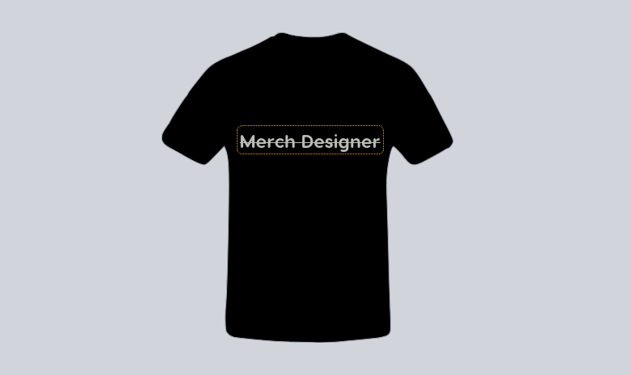

# Merch-Designer

design beautiful and amazing merches

### ⚒️ Languages / Tools

<table>

<tbody>

<tr>

<td align="Center" width="25%">

 HTML

</td>

<td align="Center" width="25%">

 CSS

</td>

<td align="Center" width="25%">

 Javascript

</td>

</tr>

</tbody>

</table>
